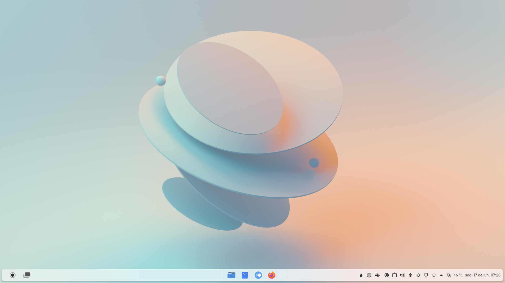

# Fedora KDE Post Install

 

This tutorial aims to improve the [Fedora Linux](https://fedoraproject.org/) experience for everyday use. You can do the same step by step in other distributions but the commands may be a little different.

## Updating the system

Install all updates that are available for your system

``` bash
sudo dnf update -y 
```
reboot your computer

## Enabling RPM Fusion

> RPM Fusion provides software that the Fedora Project or Red Hat doesn't want to ship. That software is provided as precompiled RPMs for all current Fedora versions and current Red Hat.

> We have two separate software repositories:
> - free for Open Source Software (as defined by the Fedora Licensing Guidelines) which the Fedora project cannot ship due to other reasons
> - nonfree for redistributable software that is not Open Source Software (as defined by the Fedora Licensing Guidelines); this includes software with publicly available source-code that has "no commercial use"-like restrictions

To enable access to both the free and the nonfree repository use the following command: 

``` bash 
sudo dnf install https://mirrors.rpmfusion.org/free/fedora/rpmfusion-free-release-$(rpm -E %fedora).noarch.rpm https://mirrors.rpmfusion.org/nonfree/fedora/rpmfusion-nonfree-release-$(rpm -E %fedora).noarch.rpm
```

[Documentation](https://rpmfusion.org/Configuration)

## Enabling Flathub

> Flathub is the place to get and distribute apps for all of desktop Linux. It is powered by Flatpak, allowing Flathub apps to run on almost any Linux distribution.

You can use Flathub to download popular apps like Chrome, Discord, VLC, Spotify, Steam, Telegram and more.

To enable access to Flathub use the following command:

``` bash 
flatpak remote-add --if-not-exists flathub https://dl.flathub.org/repo/flathub.flatpakrepo
```

[Documentation](https://flathub.org/setup/Fedora)

## Nvidia drivers (Current GeForce/Quadro/Tesla)

This driver is suitable for any GPU found in 2014 and later. Skip if you don't have an Nvidia graphics card.

To install Nvidia drivers use the following command:

``` bash 
sudo dnf install akmod-nvidia
sudo dnf install xorg-x11-drv-nvidia-cuda #optional for cuda/nvdec/nvenc support
```

> Please remember to wait after the RPM transaction ends, until the kmod get built. This can take up to 5 minutes on some systems.
>
> Once the module is built, "modinfo -F version nvidia" should outputs the version of the driver such as 440.64 and not modinfo: ERROR: Module nvidia not found. 

[Documentation](https://rpmfusion.org/Howto/NVIDIA)

## Media codecs

For legal reasons, Fedora does not make some codecs available in official repositories.

> Fedora ffmpeg-free works most of the time, but one will experience version missmatch from time to time. Switch to the rpmfusion provided ffmpeg build that is better supported.

To install additional media codecs use the following command:


``` bash
sudo dnf swap ffmpeg-free ffmpeg --allowerasing #  switch to the rpmfusion provided ffmpeg
sudo dnf groupupdate multimedia --setop="install_weak_deps=False" --exclude=PackageKit-gstreamer-plugin # install the complements multimedia packages needed by gstreamer enabled applications
sudo dnf groupupdate sound-and-video # install the sound-and-video complement packages needed by some applications
sudo dnf install amrnb amrwb faad2 flac gpac-libs lame libde265 libfc14audiodecoder mencoder x264 x265 # Additional codecs
```

### Hardware Accelerated Codec (optional)
#### Intel (recent)
``` bash
sudo dnf install intel-media-driver
```
#### Intel (older)

``` bash
sudo dnf install libva-intel-driver
```
#### Hardware codecs with AMD (mesa)

Using the rpmfusion-free section This is needed since Fedora 37 and later... and mainly concern AMD hardware since NVIDIA hardware with nouveau doesn't work well

``` bash
sudo dnf swap mesa-va-drivers mesa-va-drivers-freeworld
sudo dnf swap mesa-vdpau-drivers mesa-vdpau-drivers-freeworld
```

If using i686 compat libraries (for steam or alikes):

``` bash
sudo dnf swap mesa-va-drivers.i686 mesa-va-drivers-freeworld.i686
sudo dnf swap mesa-vdpau-drivers.i686 mesa-vdpau-drivers-freeworld.i686
```

#### Hardware codecs with NVIDIA
The Nvidia proprietary driver doesn't support VAAPI natively, but there is a wrapper that can bridge NVDEC/NVENC with VAAPI

``` bash
sudo dnf install libva-nvidia-driver
```
You can also install both 32bit and 64bit flavor in one command as needed.
``` bash
sudo dnf install libva-nvidia-driver.{i686,x86_64}
```

[Documentation](https://rpmfusion.org/Howto/Multimedia)

## Microsoft Fonts (optional)

> There are specific fonts that are considered almost universal for many purposes. Consider the following list:
>
> - Times New Roman
> - Arial Black
> - Arial
> - Comic Sans MS
> - Courier New
> - Impact
> - Verdana
>
> If you use Linux, however, you won't find any of the above fonts installed by default because of licensing. The popular fonts we discussed above are owned by Microsoft. The Linux operating system can't offer them out of the box because users must first agree to the end-user license agreement before those fonts can be installed and used.

To install Microsoft Fonts use the following command:

``` bash 
sudo rpm -i https://downloads.sourceforge.net/project/mscorefonts2/rpms/msttcore-fonts-installer-2.6-1.noarch.rpm
```

[How to install Microsoft fonts on Linux for better collaboration](
https://www.zdnet.com/article/how-to-install-microsoft-fonts-on-linux-for-better-collaboration/)


## Appearance and Widgets (optional)

This is a suggestion for system customization. It was inspired by modern operating systems like Windows, Chrome OS and Zorin OS and aims to be minimalist and practical. Feel free to keep the system defaults or install something cool from the [KDE Store](https://store.kde.org/browse/).

### Widgets

The widgets are, in order: Application Dashboard (or Application Launcher or Application Menu), [Toggle Overview Widget for Plasma 6](https://www.pling.com/p/2132554/), Panel Spacer, Icons-only Task Manger, Panel Spacer, Color Picker, [ChatAI](https://www.pling.com/p/2163340/), System Tray, [Wunderground PWS Widget](https://www.pling.com/p/2135799/), Digital Clock

##### Toggle Overview Widget for Plasma 6

To work you need to install the following package:

``` bash
sudo dnf install qt-qdbusviewer
```

You can change the icon if you want, in this repository you will find a modified version of the Zorin OS overview icon in Overview folder

### Theme

> Fluent kde is a microsoft fluent Design theme for KDE Plasma desktop.

Clone the [Fluent KDE](https://github.com/vinceliuice/Fluent-kde) theme repository:

``` bash
git clone https://github.com/vinceliuice/Fluent-kde.git
```

To install the theme with screenshot configuration use the command below. More customization options are available in the theme repository.

``` bash
./install.sh --round --solid 
```

### Icons

> A flat, colorful icon theme

Clone the [Tela](https://github.com/vinceliuice/Tela-icon-theme.git) icon theme repository:

``` bash
git clone https://github.com/vinceliuice/Tela-icon-theme.git
```

To install the icon theme use the command below. More customization options are available in the theme repository.

``` bash
./install.sh
# or
./install.sh -a # all color variants
# or
sudo ./install.sh -d /usr/share/icons/ -a # all color variants and SDDM support
```

### Setup ( Light | Dark )
- Global Theme: Fedora
- Colors: FluentLight | FluentDark
- Application Style: Breeze
- Plasma Style: Breeze (Follows color scheme)
- Window Decorations: Fluent-round-light-solid | Fluent-round-dark-solid
- Icons: Tela | Tela dark
- Cursors: Breeze |  Breeze Light
- Splash Screen: Fedora
- Login Screen (SDDM): Breeze Fedora
- Wallpaper (Desktop, Lockscreen and SDDM): [Blue and white round illustration](https://unsplash.com/pt-br/fotografias/blue-and-white-round-illustration-LpbyDENbQQg) | [Brown cardboard box with yellow light](https://unsplash.com/pt-br/fotografias/caixa-de-papelao-marrom-com-luz-amarela-d2w-_1LJioQ) 
- Font: Inter
  
  To install the Inter font use the command below:

  ``` bash
  sudo dnf install rsms-inter-fonts
  ```
- Fixed width font: CommitMono 

  The Commit Mono font can be obtained from the font [website](https://commitmono.com/). This font can be customized. To load the settings from this repository, upload the CommitMono/custom-settings.json file

## AI Assistants (optional)

Many modern operating systems offer Generative Artificial Intelligence to assist with everyday tasks.

To use AI in Fedora you have some options:

### ChatAI Widget

A widget for the Plasma that offers a shortcut to chatbots like:

- DuckDuckGo Chat
- ChatGPT
- HugginChat
- Google Gemini
- Bing Chat / Microsoft Copilot
- BlackBox AI

[Documentation](https://www.pling.com/p/2163340/)

### Ollama 

Ollama lets you run Llama 3, Phi 3, Mistral, Gemma, and AI models locally.

To install the Ollama use the command below:

``` bash
curl -fsSL https://ollama.com/install.sh | sh
```

To run and chat:

``` bash
ollama run [model name]
```

[Documentation](https://github.com/ollama/ollama)

## KDE Connect (optional)

> KDE Connect is a project that enables all your devices to communicate with each other. Here's a few things KDE Connect can do:
> 
> - Receive your phone notifications on your desktop computer and reply to messages
> - Control music playing on your desktop from your phone
> - Use your phone as a remote control for your desktop
> - Check your phone's battery level from the desktop
> - Ring your phone to help find it
> - Share files and links between devices
> - Browse your phone from your desktop
> - Control the desktop's volume using your phone
> - Send SMS from your desktop

KDE Connect can be downloaded for [Android](https://play.google.com/store/apps/details?id=org.kde.kdeconnect_tp) and [iOS](https://apps.apple.com/us/app/kde-connect/id1580245991).

To enable KDE Connect, follow the steps below:

1. Open KDE Connect on your computer and phone. You should now be able to see in each screen the name of the device you wish to pair with.

2. Request pairing in one of the two devices. The other device will show a prompt asking to accept the pairing request.

3. Confirm pairing.

[Documentation](https://kdeconnect.kde.org/)

## Virtual Machines with Quickemu (optional)

> Quickemu is a wrapper for the excellent QEMU that automatically "does the right thing" when creating virtual machines. No requirement for exhaustive configuration options. You decide what operating system you want to run and Quickemu takes care of the rest 🤖

Install requirements on Fedora

``` bash
sudo dnf install bash coreutils curl edk2-tools genisoimage grep jq mesa-demos pciutils procps python3 qemu sed socat spice-gtk-tools swtpm unzip usbutils util-linux xdg-user-dirs xrandr zsync spice-gtk-tools 
```

Go to the $HOME/.local/bin/ directory and clone the project

``` bash
git clone --filter=blob:none https://github.com/quickemu-project/quickemu
```

Add the quickemu path to the $PATH environment variable

``` bash
nano .bashrc
```
Paste the code below

``` bash
#Quickemu
export PATH=$PATH:$HOME/.local/bin/quickemu/
```

Save and reload the .bashrc file

``` bash
source .bashrc
```

#### Example

Ubuntu VM + Shortcut

``` bash
quickget ubuntu 24.04
quickemu --vm ubuntu-24.04.conf --shortcut
``` 

Windows 11 VM + Shortcut

``` bash
quickget windows 11
quickemu --vm windows-11.conf --shortcut 
```

[Documentation](https://github.com/quickemu-project/quickemu)
